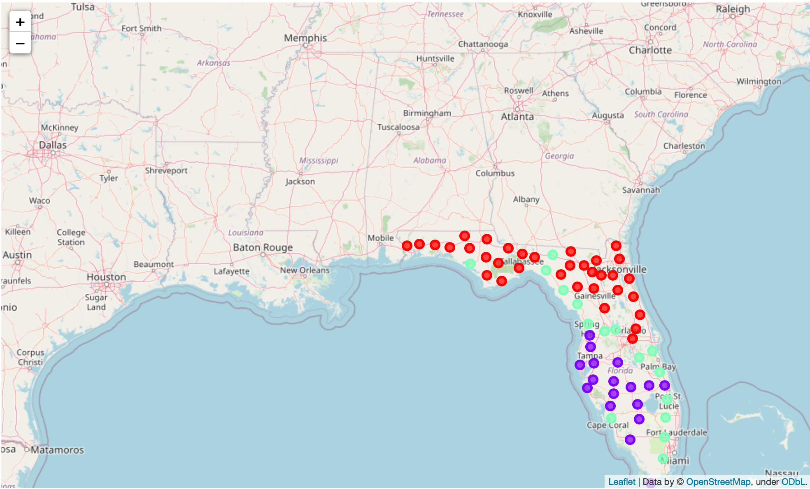
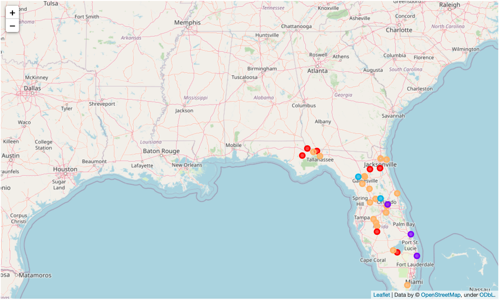

## Florida Hacks with IBM Competition 
### Submission by Damian Ohienmhen
##   

## Hackathon Overview

This challenge provided an oppourtunity to use the weatlh of data available in the public domain to address the effects of climate change. As sea water levels rise and global temperatures increase, it is important that we use all the available tools at our disposal to mitigate the worst effects of a changing climate. This challenge invites participants to use IBM Machine Learning/Artificial Intelligence tools to build solutions which address these problems.

### Challenge Statement #4 - Power Consumption

Florida has one of the largest per capita consumptions of energy in the United States. The bulk of this energy is drawn from fossil fuels leading to high carbon emissions. Currently there is a lack of public and private spending and initiatives in the Sunshine State for use of renewable energy resources such as solar and wind. 

Participants are invited to contribute to help develop applications for facilitating higher usages of renewable energy sources and optimize for efficient energy usage for all types of resources. 
 
How can we:
1. Analyze and target locations for renewable energy sources.
2. Optimize power generation to reduce overproduction.
3. Target and reduce areas of inefficient energy usage.

### Strategy and Implementation

Using the IBM Cloud Pak Data Solution and libraries available on the Notebook Platform, a detailed analysis of Florida's power consumption and renewable energy potential was carried out. Data sources such as consumable API from the National Solar Radiation Database (NSRDB) and Florida's Municipal Electric Association were used in the analysis. 

API Data was cleansed and re-formatted appropriately for the task. Major variables like Mean Direct Horizontal Irradiation (DHI), Mean Global Horizontal Irradiation (GHI) and Mean Direct Normal Irradiation were computed and used for our Machine Learning (ML) model. The K-Means Unsupervised Machine Learning Model was used to cluster the various variable points. The graphic of the resulting solution is shown below.

##   

The colored points represent the various major cities in Florida. Each of the 65 cities have now been classified across 3 different categories. They are described as follows:

1. Clusters in Purple - These points have the highest averages across each of the the variables under study. These points are recognized to have the greatest potential for both solar and wind generating assets.
2. Clusters in Light Green - These points show high means across each of the variables described in the analysis. They have been identified to have the 2nd best alternative for renewable energy assets.
3. Clusters in Red - These points show the least averages across each of the major data points under consideration. As a result, these areas have the least potential for renewable energy generation when compared to the other clusters.

Next, the question of overproduction of energy and inefficient energy usage was addressed. To compare energy usage, a variable known as Energy per Capita was computed which is the division of the Total Annual Power Sales (in kWh) by the Municipal Population. Power generation was compared across different regions using the reported energy generation capacity in each region. A DBScan Machine Learning Algorithm was used to classify the points. The resulting graphic below shows the main result.

##   

The colored points represent the five major classification points which the model returned. They are described as follows:

1. Clusters in Orange - These have the highest Energy per Capita when compared to the other points of study. They also have the largest municipal populations than the other major groupings. This would indicate an efficient use of energy from these areas.
2. Clusters in Red - These clusters have higher than normal Energy per Capita when compared to their counterparts. This could indicate inefficient energy usage in these areas.
3. Clusters in Purple - These regions show the highest than normal Energy sales when compared to their counterparts. This could indicate an overproduction of energy and a need to optimize its power production.
4. Clusters in Blue - These regions have lower than average Energy per Capita and moderate population sizes. No determination was made to the relevance of this cluser.   

A full description of the analysis as well as dashboard of the results are available by following this link to the worksheet <a href = "IBMHackathon.html">Hackathon</a>

### Conclusion

By leveraging IBM Cloud technologies including its Notebook software tool, a Machine Learning Algorithm was developed to determine areas with potention renewable enerygy generation. The Machine Learning algorithm also identified areas with an overproduction of energy and inefficient energy usage. This shows the huge potential that these technologies have to address lingering concerns around Climate Change by leveraging data to facilitate mititation and adaptation strategies. 

Links to datasets used for study.
1. API link provided by the National Solar Radiation Database (NSRDB) <a href = "https://nsrdb.nrel.gov/data-sets/api-instructions.html">NSRDB API</a>
2. Link to dataset provided by the Florida Municipal Electric Association (FMEA) Website <a href = "https://assets.noviams.com/novi-file-uploads/fmea/Stats/2019_florida_publicpower_utility_statistical_information.xls">FMEA Dataset</a>
