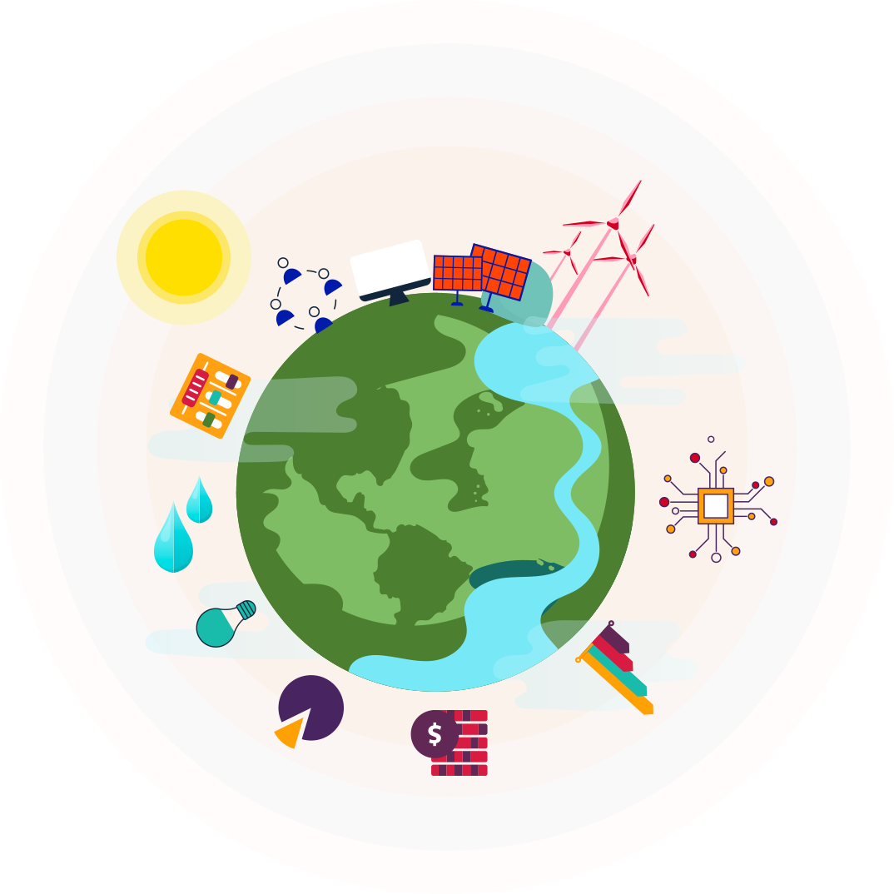

## Florida Hacks with IBM Competition 
### Submission by Damian Ohienmhen
##   

## Hackathon Overview

This challenge provided an oppourtunity to use the weatlh of data available in the public domain to address the effects of climate change. As sea water levels rise and global temperatures increase, it is important that we use all the available tools at our disposal to mitigate the worst effects of a changing climate. This challenge invites participants to use IBM Machine Learning/Artificial Intelligence tools to build solutions which address these problems.

### Challenge Statement #4 - Power Consumption

Florida has one of the largest per capita consumptions of energy in the United States. The bulk of this energy is drawn from fossil fuels leading to high carbon emissions. Currently there is a lack of public and private spending and initiatives in the Sunshine State for use of renewable energy resources such as solar and wind. 

Participants are invited to contribute to help develop applications for facilitating higher usages of renewable energy sources and optimize for efficient energy usage for all types of resources. 
 
How can we:
1. Analyze and target locations for renewable energy sources.
2. Optimize power generation to reduce overproduction.
3. Target and reduce areas of inefficient energy usage.

<a href = "IBMHackathon.html">Hackathon</a>
For more details see [GitHub Flavored Markdown](https://guides.github.com/features/mastering-markdown/).

### Jekyll Themes

Your Pages site will use the layout and styles from the Jekyll theme you have selected in your [repository settings](https://github.com/damianohienmhen/IBM/settings/pages). The name of this theme is saved in the Jekyll `_config.yml` configuration file.

### Support or Contact

Having trouble with Pages? Check out our [documentation](https://docs.github.com/categories/github-pages-basics/) or [contact support](https://support.github.com/contact) and we’ll help you sort it out.
